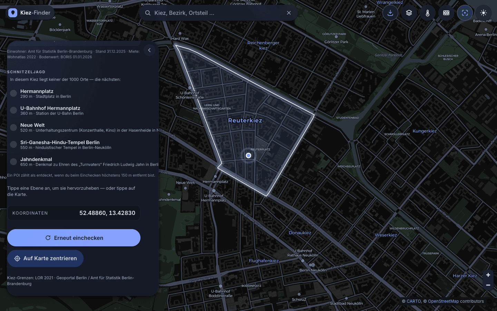
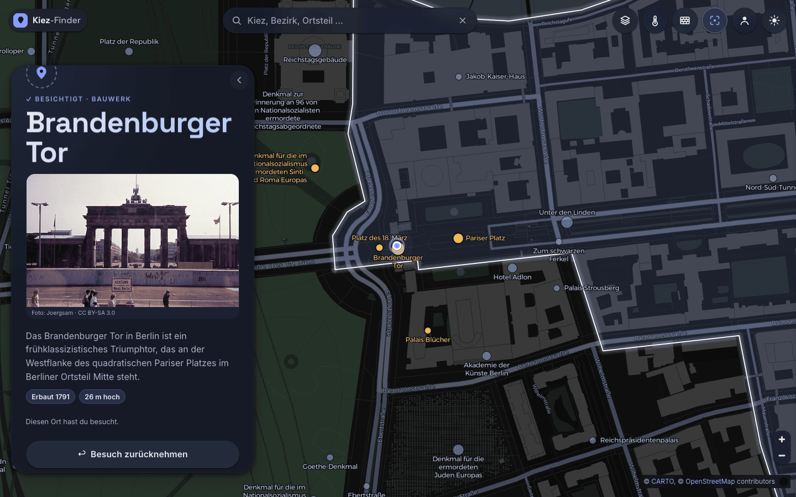
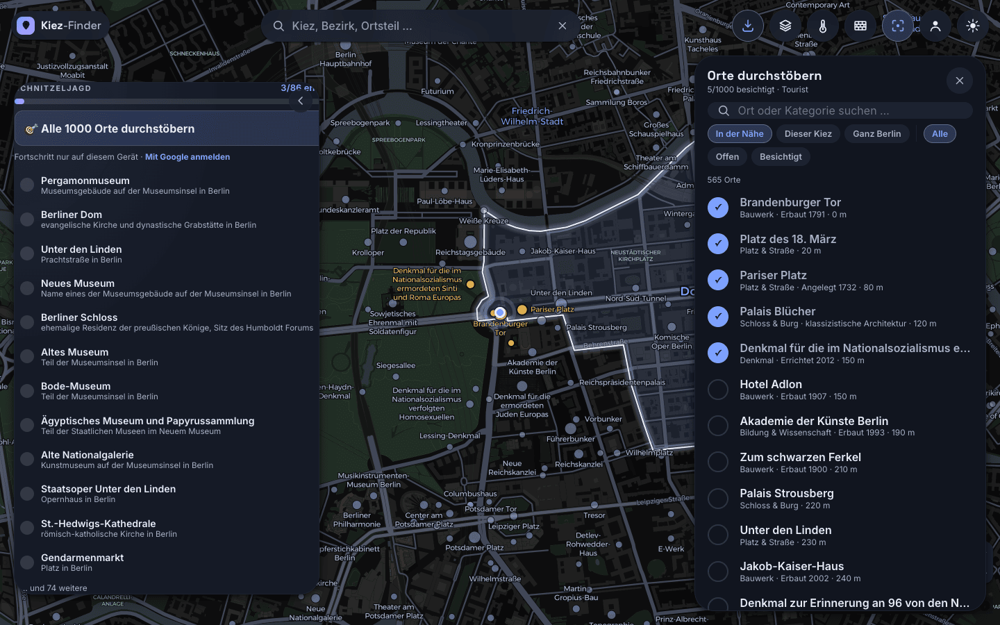
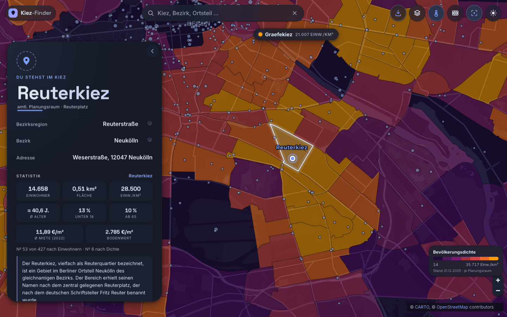

<div align="center">


# 🧭 Kiez-Finder

### Dein Kiez-Pass für Berlin — check ein und erfahre sofort, in welchem Kiez du gerade stehst.

[](https://github.com/pepperonas/kiez-finder/actions/workflows/ci.yml)
[](#tests-ausf%C3%BChren)
[](#tech-stack)
[-100.00%25_lines-brightgreen)](#tests-ausf%C3%BChren)
[](https://kiezfinder.celox.io)
[](package.json)
[](LICENSE)
[](#tech-stack)

</div>

---

## Was ist das?

Berlin ist keine Stadt, sondern ein Haufen Kieze. **Kiez-Finder** bestimmt per Geolocation,
in welchem der **542 offiziellen Berliner Planungsräume (LOR 2021)** du gerade stehst,
zeichnet die Grenze deines Kiezes auf die Karte und zeigt dir die volle Hierarchie:

> **Kiez** → Bezirksregion → Prognoseraum → **Bezirk**, dazu die genaue Adresse und Koordinaten.

Die Klassifizierung läuft gegen die **amtlichen Kiez-Grenzen** (Point-in-Polygon im Browser) —
nicht gegen ungenaues Reverse-Geocoding. Stehst du außerhalb der Stadtgrenze, sagt der Pass dir das auch.

**Das Konzept: ein Kiez-Pass.** Eine einzige Idee, durch jede Schicht gezogen: *Du checkst an
deinem Standort ein, und die Stadt verrät dir, welcher Kiez dich gerade beherbergt.* Die Sprache
(„einchecken"), die Karte (eine gestempelte Pass-Karte), der **Signature-Moment** (Lock-on: die
Kamera fliegt zu dir, dann zeichnet sich deine Kiez-Grenze selbst ein) und der Leerzustand
(„außerhalb der Stadtgrenze gilt der Pass nicht") gehorchen alle diesem einen Satz.

## Features

- 🔎 **Fuzzy-Suche** über alle Ebenen (Bezirke · Bezirksregionen · Prognoseräume · Kieze · Planungsräume) **und jede benannte Straße Berlins** — eigener, abhängigkeitsfreier Berlin-getunter Scorer: Umlaut-/ß-/„straße"-Faltung, Präfix→Wort→Substring→Subsequenz→Tippfehler-Tiers, ~2 ms/Suche über ~12.500 Einträge. Treffer wählen → Fläche wird hervorgehoben
- 🛣️ **Straßensuche** — alle ~10.100 benannten Straßen (Overpass/OSM, ~11.400 Einträge: gleichnamige Straßen in verschiedenen Stadtteilen bleiben getrennte Treffer, unterschieden per Bezirk-Unterzeile). Straße wählen → Beacon landet **auf der Straße**, ihr **Kiez wird aufgelöst und hervorgehoben** („Sonnenallee → in Weiße Siedlung · Neukölln"), die Kamera rahmt die **volle Straßenausdehnung** (kurze Gassen nah bei max z15.5, die 5-km-Sonnenallee komplett). Datensatz: kompakte 833 KB (`strassen.json`), einmalig gebaut via `tools/build-streets.js`
- 📍 **Standort → Kiez** über die offiziellen LOR-2021-Planungsräume (542 Kieze), Point-in-Polygon im Browser
- 🗣️ **Umgangssprachlicher Kiez** — der geläufige Kiez-Name (z.B. *Schillerkiez*, *Flughafenkiez*) ist der Titel; der amtliche Planungsraum (z.B. *Wartheplatz*) steht als Unterzeile
- 🧩 **Kiez als EINE Fläche** — ein umgangssprachlicher Kiez besteht oft aus mehreren amtlichen Planungsräumen (Schillerkiez = Hasenheide + Schillerpromenade Nord/Süd + Wartheplatz). Die werden **zusammengeführt** und als eine zusammenhängende Fläche hervorgehoben — präzise, nicht die zu grobe Bezirksregion (355 Kiez-Flächen aus 542 Planungsräumen)
- 🏘️ **Feinkörnige OSM-Kieze** — benannte Kieze, die *kleiner* als ein Planungsraum sind (z.B. *Scheunenviertel*, *Möckernkiez*, *Fischerinsel*), kommen mit ihrer **exakten OSM-Grenze** (71 Polygone) — suchbar, hervorhebbar und beim Drinstehen automatisch erkannt
- 🧅 **Wählbare LOR-Ebenen** — tippe in der Card auf **Kiez · Bezirksregion · Bezirk**, und die zugehörige Fläche wird hervorgehoben (Auto-Zoom auf ihre Ausdehnung)
- 📊 **Bereichs-Statistik in der Card** — für die gewählte Einheit (Kiez · Bezirksregion · Prognoseraum · Bezirk, auch aus der Suche): **Einwohnerzahl** aus der amtlichen **Einwohnerregisterstatistik** (je LOR-Planungsraum, Stand 31.12.2025, exakt auf die Einheit aufsummiert), **amtliche Fläche** (Geoportal `finhalt`), **Dichte** (Einw./km²), **Altersstruktur** (Ø-Alter ≈ aus Altersband-Mitten — Berlin-Kontrolle: 42,9 vs. amtlich 42,8) , **Ø-Angebotsmiete + Ø-Bodenrichtwert** (einwohnergewichtete Mittel der Mitglieds-Planungsräume — ungewichtete Mittel würden leere Randlagen überbetonen) und **Ränge** („№ 53 von 427 nach Einwohnern · № 6 nach Dichte" — der Reuterkiez ist wirklich der sechst­dichteste Kiez Berlins). Die Stats **folgen der Ebenen-Auswahl live**; SAFE-anonymisierte Planungsräume werden ehrlich ausgewiesen („≥"-Untergrenze bzw. „k. A."), feine OSM-Kieze zeigen ihre geodätisch berechnete Fläche statt erfundener Amtszahlen; auch die **Straßensuche** zeigt die Stats des aufgelösten Kiezes. Alles offline (3 statische JSONs, ~78 KB, precached)
- 🎯 **Schnitzeljagd — die 1000 interessantesten Orte Berlins** — recherchiert aus **Wikidata** (CC0): Kandidaten sind Bauwerke, Kulturgüter, Museen, Denkmäler, Parks, Kirchen, Friedhöfe & Touristenziele *innerhalb* Berlins; „interessant" misst sich an der Zahl der Wikipedia-Sprachversionen (Brandenburger Tor 85, Reichstag 74, Fernsehturm 58). Zwei Korrekturen halten die Auswahl spielbar: eine **Bezirks-Quote** (mind. 45 je Bezirk — sonst lägen zwei Drittel in Mitte) und ein **Kategorie-Deckel** (13 % — ungedeckelt verdrängten 207 gewöhnliche U-/S-Bahnhöfe die echten Sehenswürdigkeiten). Auf der Karte erscheinen alle 1000 als Punkte (Größe nach Prominenz, Namen ab z14); **entdeckt wird per Standort**: liegt ein Ort beim Einchecken höchstens **150 m** entfernt, zählt er — mit Jubel-Toast und Rang-Aufstieg (*Neu in der Stadt → Tourist → Zugezogen → Kiezgänger → Stadtbekannt → Urgestein → Berlin-Legende*). Antippen zeigt einen Ort nur an; das ist Absicht, sonst wäre es eine Checkliste statt einer Jagd. Die Card zeigt den Fortschritt des aktuellen Bereichs („3/86 entdeckt" + Balken + Liste) — und in den 162 Kiezen ohne eigenen POI stattdessen die **nächstgelegenen Ziele mit Entfernung**. Fortschritt wird lokal gespeichert (`kf-hunt`) und ist konfliktfrei mergebar. Über **„🎯 Alle 1000 Orte durchstöbern"** (in der Jagd-Sektion) öffnet sich eine **durchsuch- und filterbare Übersicht** (Bereich: In der Nähe · Dieser Kiez · Ganz Berlin; Status: Alle · Offen · Besichtigt; Volltextsuche), aus der man zu jedem Ort auf der Karte springt. Jeder Ort zeigt **1–2 Eckdaten** (z. B. „Erbaut 1791 · 26 m hoch") **plus einen Wikipedia-Einleitungstext und ein Foto** in der Detail-Card (993/1000 mit Text, 959 mit Bild). Die Texte + Fakten sind **offline** (precached); die Fotos laden von Wikimedia Commons zur Laufzeit (mit korrekter Urheber-/Lizenz-Zeile) und fehlen offline einfach — die Card bleibt vollständig. Orte lassen sich in der Übersicht **und** in der Detail-Card **manuell als besichtigt setzen und wieder zurücknehmen** — jede Änderung mit **Rückgängig-Snackbar** gegen Fehlklicks
- ☁️ **Optionaler Konto-Sync (Google)** — über den **Personen-Button in der Topbar** (immer erreichbar, auch ohne Standort-Freigabe); der Jagd-Fortschritt lebt standardmäßig **nur lokal**, wer will, sichert ihn per Google-Login geräteübergreifend. Bewusst datensparsam: gespeichert werden **Google-`sub` (stabile ID), Anzeigename und besuchte POI-IDs** — *keine E-Mail* (der `email`-Scope wird gar nicht angefordert), keine Google-Tokens, kein Tracking. Der Abgleich ist ein **Union-Merge** (lokal ∪ Server, früherer Erstbesuch gewinnt) — kommutativ und idempotent, also können mehrere Geräte parallel sammeln, ohne sich zu überschreiben. **Die App bleibt vollständig offline-fähig**: fällt das Backend aus, ist man nicht angemeldet oder ist das Gerät offline, läuft alles unverändert lokal weiter
- 📖 **„Über diesen Kiez" — für JEDEN Bereich** — gestuft aus mehreren Quellen: ① **Wikipedia**-Kurztext, autoritativ verknüpft über die `wikipedia`/`wikidata`-Tags aus **OpenStreetMap** (statt Namensraten — findet Artikel, die reines Namensmatching verfehlt, und kann nicht auf ein fremdes Redirect-Ziel driften), ② Namenssuche mit Relevanz-Regel, ③ **Wikidata**-Kurzbeschreibung (CC0), ④ OSM-`description`. **175 recherchierte Texte** — und wo es beim besten Willen keinen gibt (rund zwei Drittel der Kieze haben schlicht keinen Artikel), erzeugt die App zur Laufzeit eine **Faktenzeile aus den amtlichen Zahlen** („Kiez im Bezirk Neukölln, Teil der Bezirksregion Reuterstraße. Hier leben rund 14.700 Menschen auf 0,51 km². Das Durchschnittsalter liegt bei etwa 40,6 Jahren."). So steht **überall** Kontext, ohne dass ein einziger Satz erfunden wird; jede Karte weist ihre Quelle und Lizenz aus
- 🖱️ **Karte ist anklickbar** — tippe irgendwohin in Berlin, und die Card springt auf den Kiez dieses Punkts (inkl. neuer Adresse)
- ⛶ **Auto-Zoom-Schalter** (Topbar) — legt fest, ob ein **Karten-Tap** automatisch auf den getroffenen Kiez heranzoomt (Standard: an). Ausgeschaltet wird die Fläche zwar markiert, die Kamera bleibt aber stehen — praktisch zum Erkunden benachbarter Kieze, ohne dass die Karte bei jedem Tipp springt. Betrifft nur den Tap; „Auf Karte zentrieren", die Ebenen-Auswahl, die Suche und der Geo-Check-in rahmen weiterhin. Zustand wird gemerkt
- 🗺️ **Sektoren-Overlay** (4-Stufen-Button) — *aus · Bezirke (L) · Regionen (M) · Kieze (S)*, von grob nach fein. Färbt die jeweilige Ebene **nachbarschafts-bewusst** (Distanz-2-Graph-Coloring über geteilte Grenzen) → angrenzende **und** nahe Flächen bekommen weit auseinanderliegende Farbtöne und sind klar unterscheidbar. **Jede sichtbare Fläche wird beschriftet** — pro Region ein Label an einem sichtbaren Innenpunkt, beim Zoomen/Verschieben nachgeführt (nicht nur die Fläche, deren Mittelpunkt zufällig im Bild liegt); **kartografische Hierarchie**: Kollisionspriorität + Labelgröße folgen der Flächengröße (große Flächen gewinnen und lesen größer), bedrängte Labels weichen per variablem Anker aus statt zu verschwinden, Label-Punkte bleiben beim Verschieben stabil (Anti-Jitter-Hysterese), und die **ausgewählte Fläche trägt immer ihr eigenes akzentfarbenes Label** (höchste Priorität, keine Doppelung). Zusätzlich benennt eine schwebende **„Aktueller-Bereich"-Plakette** mit Farbpunkt live die Fläche in der Kartenmitte
- 🟦 **Starke Auswahl-Umrandung** — die aktive Auswahl wird mit kräftiger heller Linie + dunklem Casing-Halo gezeichnet, damit sie auch über dem dichten Farb-Overlay klar heraussticht
- 🌡️ **Heatmaps** (eigener Topbar-Button mit Metrik-Popover) — färbt ganz Berlin je **Planungsraum** als Choroplethe nach **Bevölkerungsdichte · Ø-Alter · Angebotsmiete · Bodenrichtwert Wohnbauland**. Preise aus amtlich-offenen Quellen (beide **dl-de-zero-2.0**): Angebotsmieten €/m² netto kalt je Prognoseraum aus dem *Wohnatlas Berlin* (2022), Bodenrichtwerte 01.01.2026 aus *BORIS* (812 Wohnbauland-Zonen, je PLR über ein Innenpunkt-Raster gemittelt). **Quantil-Klassen** (7) statt linearer Skala — Berlins Verteilungen sind so schief, dass linear fast einfarbig wäre; farbfehlsichten-taugliche Sequenz-Rampen (dunkel: Inferno-glühend, hell: Viridis), **Legende** mit Min/Max + Stichtag, die schwebende Plakette zeigt live **Kiez-Name + Metrikwert** unterm Kartenzentrum („Graefekiez · 21.007 Einw./km²"). PLRs ohne Daten bleiben ehrlich transparent; exklusiv zu Sektoren-Overlay und Mauer-Modus; Metrik persistiert (`kf-heat`), komplett offline (`preise.json` 12 KB precached)
- 🧱 **Berliner-Mauer-Modus (Retro)** — eigener Topbar-Button: die Karte wechselt in einen **Schwarz-Weiß-Archivlook** (Graustufen + Sepia-Hauch, Filmkorn, Vignette) und zeigt den **offiziellen Mauerverlauf von 1989** (Geoportal Berlin, digitalisiert vom Luftbild 25.04.1989): Grenzmauer als markante Doppellinie, Hinterlandmauer gestrichelt, **Grenzstreifen („Todesstreifen") als echte Fläche**, und **beide Stadthälften eigenständig getönt** (West als solide Aufhellung, Ost zusätzlich **diagonal schraffiert** — die klassische Archiv-Signatur, beide klar vom Brandenburger Umland abgesetzt) mit großen **WEST-BERLIN / OST-BERLIN**-Sektor-Schriftzügen im Archivkarten-Stil. Dazu **zwei Spot-Farben wie auf alten Druckkarten**: Spree, Kanäle und Seen in gedecktem **Tintenblau**, Parks in gedämpftem **Grün** — übersättigt ins Canvas gemalt, sodass sie den (abgeschwächten) S/W-Filter als gealterte Töne überleben. Die schwebende Plakette wird zum **Ost/West-Anzeiger** („West-Berlin · 1989") — Point-in-Polygon gegen die abgeleiteten Sektor-Polygone (West 480 km² aus Grenzmauer + politischer Grenze verschmolzen; Ost 410 km² = Stadtgebiet minus Mauerring, inkl. der historisch korrekten DDR-Exklave **West-Staaken**). Der Modus erfasst die **ganze Seite**: alle UI-Flächen (Pass-Karte, Topbar, Suche, Buttons, Plakette) wechseln auf ein Tusche-/Papier-Farbschema und **Schreibmaschinen-Typografie** (System-Courier, 0 KB), und die Pass-Karte bekommt einen **Aktenstempel** „SEKTOR · 1989 — OST-BERLIN / Sowjetischer Sektor" (bzw. West: „Amerikanischer · Britischer · Französischer Sektor"), der dir sagt, auf welcher Seite der Mauer dein Standort gelegen *hätte*. Modus persistiert; schließt sich mit dem Farb-Overlay gegenseitig aus (Farben wären in S/W sinnlos), das vorherige Overlay kommt beim Verlassen zurück
- 🏷️ **Eigene Label-Ebene** — Bezirke groß/hell (schon bei weitem Zoom), Bezirksregionen kleiner; MapLibre-Kollision zeigt immer die im Ausschnitt passenden Labels (Basemap-Ortsteil-Labels werden ausgeblendet, damit die offizielle Hierarchie dominiert)
- 🗺️🗣️ **Umgangssprachliche Kiez-Namen auf der Karte** — 537 OSM-Kieze (`place=quarter`/`neighbourhood`, z.B. Flughafenkiez, Reuterkiez, Sprengelkiez) als akzentfarbene Labels bei höherem Zoom
- 🗺️ **Lebendige Vektorkarte** (MapLibre GL) mit `flyTo`-Lock-on und sich selbst zeichnender Kiez-Grenze; ab Kiez-Zoom erscheinen **Straßennamen und Grünflächen dezent** (gedämpfte Töne + sanftes Grün, eine Zoomstufe früher als die Basemap sie zeigen würde — sie ordnen sich den Kiez-Labels immer unter)
- 🎨 **Material 3 Expressive** — Feder-Physik statt Easing-Fades, tonale Flächen, XL-Shapes, Shape-Morph beim Tippen
- 🌗 **Hell/Dunkel** mit kreisförmigem View-Transition-Reveal wie auf celox.io (900 ms Desktop / 520 ms Mobile, dark-matter ↔ positron), **der auch die Karte mitzieht**: die WebGL-Karte restylt erst nach der Animation, deshalb wird sie während des Reveals per invert-Filter aufs Ziel-Theme angenähert und hinter einem eingefrorenen Standbild („Veil") umgestylt, das erst weich ausblendet, sobald die neuen Kacheln wirklich gerendert sind — kein harter Blitz, auch bei schnellem Hin-und-her-Schalten
- 📱 **PWA + Mobile** — installierbar, **echt offline-fähig**: alle 19 Datensätze (~3,4 MB — Kieze, Bezirke, Regionen, Labels, Mauerverlauf, Straßenindex, Einwohner-Statistik, Kiez-Beschreibungen, 1000 POIs …) werden vom Service Worker **revisioniert precached** — einmal besucht, klassifiziert die App auch ohne Netz, und Daten-Updates busten den Cache automatisch beim Deploy. Schlägt der Kern-Datensatz beim allerersten Laden fehl (offline/404), zeigt die App eine ehrliche **„Daten nicht geladen"-Card mit Retry** statt fälschlich „nicht in Berlin". Die Card ist auf Mobilgeräten ein **MD3-Bottom-Sheet** mit echten **Swipe-Gesten**: vom 44-px-Griff oder der ganzen Karte hoch-/runterziehen, **Pull-down vom Listenanfang** zum Einklappen, **Tap aufs eingeklappte Sheet** zum Öffnen; geschwindigkeits- + positionsbasiertes Snapping (leichter Flick genügt), Scroll-vs-Drag korrekt getrennt, nicht-modal über der Karte, Safe-Area-Insets, `dvh`-Höhe. Auf **Desktop** lässt sich das Info-Panel ein- und ausklappen (Pfeil-Button → schiebt es zur Seite, Reopen-Tab holt es zurück; Zustand wird gemerkt)
- ♿ **Robust** — Progressive Enhancement, `prefers-reduced-motion`, sichtbarer Fokus, Tastatur (`R` = neu einchecken), Touch-Targets ≥ 44 px
- 🔑 **Kein API-Key** — keyless Carto-Tiles + Nominatim, keine Secrets im Code

## Screenshots

<div align="center">


<sub><i>Der Signature-Moment: Lock-on auf den Standort, die Kiez-Grenze zeichnet sich selbst ein</i></sub>

<br/><br/>


&nbsp;


<sub><i>MD3-Bottom-Sheet auf Mobil · Kieze-Overlay (S): das nachbarschafts-bewusst eingefärbte Kiez-Patchwork</i></sub>

<br/><br/>



<sub><i>Und die angereicherte POI-Card — Wikipedia-Text, Foto (mit Urheber/Lizenz) und Eckdaten:</i></sub>



<sub><i>Und die durchsuch-/filterbare Orte-Übersicht (manuelles Besichtigt-Setzen + Zurücknehmen):</i></sub>



<sub><i>Schnitzeljagd: 1000 Orte als Kartenpunkte · in Kiezen ohne eigenen POI die nächsten Ziele mit Entfernung</i></sub>

<br/><br/>


&nbsp;


<sub><i>Heatmap „Bevölkerungsdichte" (Quantil-Klassen, Legende, Wert-Plakette) · Berliner-Mauer-Modus 1989 mit Sektor-Stempel</i></sub>

<br/><br/>


<sub><i>Bezirke-Overlay (L) mit „Aktueller-Bereich"-Plakette</i></sub>

</div>

## Installation

```bash
git clone https://github.com/pepperonas/kiez-finder.git
cd kiez-finder
npm install
```

Voraussetzungen: **Node ≥ 20** (die CI testet 20 + 22). Keine API-Keys, keine `.env` — es gibt keine Secrets.

## Quickstart

```bash
npm run dev       # Vite-Dev-Server (Geolocation braucht einen secure context → localhost zählt)
npm run build     # Production-Build nach dist/
npm run preview   # Build lokal testen
```

> **Hinweis:** Geolocation braucht einen *secure context*. `localhost` gilt als sicher; auf anderen
> Hosts muss HTTPS aktiv sein. Ohne Standort-Freigabe funktioniert die App trotzdem — einfach auf
> die Karte tippen oder die Suche benutzen.

## Konfiguration

Die App hat **keine Build-Konfiguration und keine Secrets** — alles Nutzer-Einstellbare wird
automatisch in `localStorage` persistiert:

| Key | Werte | Bedeutung |
|---|---|---|
| `kf-theme` | `dark` \| `light` | Farbschema (Default: dunkel bzw. `prefers-color-scheme`) |
| `kf-overlay` | `off` \| `bezirke` \| `bzr` \| `kiez` | aktives Sektoren-Overlay |
| `kf-wall` | `1` \| `0` | Berliner-Mauer-Modus |
| `kf-autozoom` | `1` \| `0` | Auto-Zoom beim Karten-Tap (Default: an) |
| `kf-panel` | `open` \| `collapsed` | Desktop-Info-Panel ein-/ausgeklappt |
| `kf-hunt` | JSON | Schnitzeljagd-Fortschritt (besuchte POI-IDs + Zeitstempel) |
| `kf-heat` | `off` \| `dichte` \| `alter` \| `miete` \| `brw` | aktive Heatmap-Metrik |

Der **optionale Konto-Sync** braucht als Einziges ein Backend (`server/`, s. [Deploy](#deploy)) —
ohne es fehlt nur der Login; die App selbst bleibt statisch und offline-fähig.

Fürs **Hosting** gibt es genau ein Muss: der Webserver muss
`Permissions-Policy: geolocation=(self)` **auf dem HTML-Dokument** setzen — bei nginx auch im
`location = /index.html`-Block, weil das `try_files`-Fallback die Server-Header dort sonst
verwirft (Details in [CLAUDE.md](CLAUDE.md)).

### Kiez-Daten neu erzeugen

Die Grenzen liegen vorverarbeitet unter `public/data/`. Neu aus der amtlichen Quelle bauen:

```bash
# 1) LOR-2021-Planungsräume (WGS84) vom Geoportal Berlin
curl "https://gdi.berlin.de/services/wfs/lor_2021?service=WFS&version=2.0.0&request=GetFeature&typeNames=lor_2021:a_lor_plr_2021&outputFormat=application/json&srsName=EPSG:4326" -o plr.geojson

# 2) auf die nötigen Felder reduzieren + vereinfachen (~628 KB)
npx mapshaper plr.geojson -filter-fields plr_id,plr_name,bzr_name,pgr_name,bez \
  -simplify 12% keep-shapes planar -clean -o public/data/kieze.geojson precision=0.00001

# 3) Stadtgrenze für den Übersichts-Zustand
npx mapshaper public/data/kieze.geojson -dissolve -o public/data/berlin-outline.geojson precision=0.0001

# 4) aggregierte Ebenen für die Highlight-Auswahl (aus den Kiezen dissolved,
#    genestet über die plr_id-Präfixe: Bezirk 2 ⊃ Prognoseraum 4 ⊃ Bezirksregion 6 ⊃ Kiez 8)
npx mapshaper public/data/kieze.geojson -each 'id=plr_id.substring(0,2)' -dissolve id copy-fields=bez                -o public/data/bezirke.geojson precision=0.0001
npx mapshaper public/data/kieze.geojson -each 'id=plr_id.substring(0,4)' -dissolve id copy-fields=pgr_name,bez       -o public/data/prognoseraeume.geojson precision=0.00001
npx mapshaper public/data/kieze.geojson -each 'id=plr_id.substring(0,6)' -dissolve id copy-fields=bzr_name,bez       -o public/data/bezirksregionen.geojson precision=0.00001

# 5) zusammengeführte „Kiez-Flächen" (umgangssprachliche Kieze):
#    jeder Planungsraum wird per Reverse-Geocoding (Nominatim, quarter/neighbourhood)
#    seinem umgangssprachlichen Kiez zugeordnet, dann nach Kiez-Name + zusammenhängender
#    Komponente gruppiert (shared-vertex Adjazenz) und per `-dissolve gid` verschmolzen.
#    Ergebnis: kieze.geojson bekommt gid+kiez je Planungsraum, kiez-areas.geojson = eine
#    Fläche je Kiez (355 aus 542). Quarter ist nicht flächendeckend → ~78 % Abdeckung,
#    der Rest bleibt sein eigener Planungsraum. (Build-Skripte: siehe git-Historie.)

# 6) OSM-Kiez-Namen (Punkt-Labels) via Overpass → kiez-names.geojson
#    node-Query: place=quarter|neighbourhood in Berlin → 537 Punkte

# 7) Straßenindex → strassen.json (für die Suche)
#    Overpass: alle benannten highway-Ways in Berlin mit per-Way-Bounds ("out tags bb;",
#    Query im Kopf von tools/build-streets.js), dann:
curl -sS --data-urlencode data@query.txt https://overpass-api.de/api/interpreter > streets-raw.json
node tools/build-streets.js streets-raw.json
#    93.831 Ways → 10.119 Namen → 11.446 Cluster (Union-Find: gleichnamige Segmente
#    innerhalb ~300 m verschmelzen; entfernte Namensvettern wie die 10 Hauptstraßen
#    bleiben getrennt). Je Cluster: Union-BBox, ein Punkt AUF der Straße, Bezirk per
#    eigenem Point-in-Polygon. Kompaktformat [name, bezIdx, cx, cy, bbox×4] → 833 KB.
```

### Statistiken + Kiez-Beschreibungen neu erzeugen

```bash
node tools/build-stats.mjs      # → public/data/stats.json (Einwohner + amtliche Fläche je PLR;
                                #   hermetisch aus tools/vendor/, validiert gegen kieze.geojson)
node tools/build-kiez-info.mjs  # → public/data/kiez-info.json (Wikipedia-Kurztexte, ~2 min,
                                #   Begriffsklärungs- und Berlin-Plausibilitätsfilter)
node tools/build-pois.mjs       # → public/data/pois.json (1000 POIs aus Wikidata, ~20 s)
node tools/build-poi-facts.mjs  # reichert pois.json um 1–2 Eckdaten je POI an (Wikidata, ~30 s)
node tools/build-poi-info.mjs   # → public/data/poi-info.json (Wikipedia-Text + Commons-Bild je POI, ~2–3 min)
node tools/build-poi-images.mjs # lädt die Fotos, optimiert zu WebP → public/img/poi/ (sequenziell, ~6–8 min)
node tools/build-kiez-images.mjs# Kiez-Fotos → public/img/kiez/ (~12–15 min; KF_FORCE=1 = alle neu, KF_GIDS=k12,k39 = gezielt)
node tools/build-heat-prices.mjs # → public/data/preise.json (Angebotsmieten je Prognoseraum +
                                #   Bodenrichtwerte Wohnbauland je PLR, beide live vom Geoportal-WFS,
                                #   dl-de-zero-2.0; validiert Abdeckung + Plausibilitäts-Median)
```

Neuer EWR-Stichtag: aktuelle `EWR_L21_*E_Matrix.csv` besorgen (daten.berlin.de bzw. Mirror,
siehe `tools/vendor/README.md`), nach `tools/vendor/` legen, `STAND` in `build-stats.mjs`
anpassen, Skript validiert den Rest (542 IDs, Plausibilitäts-Summe).

### Screenshots neu erzeugen

```bash
npm run build && npm run preview -- --port 4190   # Terminal 1
node tools/screenshots.cjs                        # Terminal 2 (braucht Playwright + Chrome)
```

## Tests ausführen

```bash
npm test                                                        # 238 Unit-Tests, Nodes eingebauter Runner, null Test-Dependencies
node --test --experimental-test-coverage tests/*.test.js        # dito + Coverage-Report
node tools/badges.mjs                                           # misst + SCHREIBT die Badges (LOC/Tests/Coverage); --check = nur prüfen
```

Getestet wird die **abhängigkeitsfreie Pure-Logik** — Stand heute **238 Tests, 100 % Line-Coverage**
auf allen acht unit-testbaren Modulen (~97 % Branch):

| Modul | Was abgesichert ist |
|---|---|
| `src/kiez.js` | Point-in-Polygon-Klassifizierung (Löcher, MultiPolygon), Hierarchie-Ableitung (`featureForLevel`, `levelName`), `findOsmKiez`-Nesting (kleinste Fläche gewinnt), `kiezAreaFor`-Fallbacks — und die **Loader per fetch-Mock**: Memoisierung, optionale Datensätze fehlen sauber, Kern-Datensatz-Fehler wird als Fehler gemeldet (nie als „nicht in Berlin"), `loadWall`/`loadStreets` **Fail → Reset → Retry** |
| `src/search.js` | Umlaut-/ß-/„straße"-Faltung, Multi-Tier-Scoring, Typ-Priorität, Dedup, Straßen-Einträge |
| `src/geo.js` | Geolocation-**Fehler-Mapping** (denied/unavailable/timeout/unknown/unsupported), Nominatim-Adresszeilen-Assemblierung, Kiez-Extraktion (`quarter`→`neighbourhood`), Koordinaten-gerundetes Caching, Best-Effort-Fehlpfade → `null` |
| `src/motion.js` | **Spring-Physik** mit Fake-Clock + deterministischem rAF: exakte Konvergenz, **Overshoot bei damping 0.6** (der Signature-Bounce), kein Overshoot bei 0.8, Cancel mid-flight, `reduced-motion`-Sofortpfade, Stagger-Reveal, Pointer-Damper |
| `src/stats.js` | Bereichs-Statistik: gid-/Präfix-**Selektoren**, PLR-**Aggregation** (inkl. „≥"-Untergrenzen bei SAFE-anonymisierten Räumen), **Ränge** je Ebene, geodätische Fläche (OSM-Kieze), Wikipedia-Lookups, de-DE-Formatierung |
| `src/hunt.js` | Schnitzeljagd: Haversine-Distanz + Umkreis, nächstgelegene Ziele, robustes Lesen/Schreiben des Fortschritts, **idempotentes** Besuchen, **kommutativer Union-Merge** (Sync-Vorbereitung), Auswertung je Bereich, Ränge |
| `server/lib/*` | Backend-Sicherheit: HMAC-Session (fremd signiert / manipuliert / abgelaufen / Müll ⇒ abgewiesen), Cookie-Parsing inkl. Shadowing, Upload-Validierung (QID-/Zeitstempel-Plausibilität, Mengendeckel), Union-Merge |
| `src/heat.js` | Heatmap-Kern: Metrik-Katalog, **Heat-FC-Join** (fehlende Werte werden weggelassen, nicht genullt), **Quantil-Klassengrenzen** (Schiefe, Duplikat-Dedup), Klassenindex, MapLibre-**Paint-Expression** (`has`→`step`), Legenden-Daten, Farbrampen |
| `src/prefs.js` | `localStorage`-Persistenz-Semantik (Defaults, Garbage-Fallback, werfende Storage) |

`main.js`/`map.js` hängen an DOM + MapLibre/WebGL und sind bewusst nicht unit-getestet — testwürdige
Logik wird stattdessen in maplibre-freie Module extrahiert (so entstand `prefs.js`). Die CI
(GitHub Actions, Node 20 + 22) führt bei jedem Push Tests + Coverage + Production-Build aus **und
aktualisiert per `.github/workflows/badges.yml` (`tools/badges.mjs`) die Badges oben (Unit-Tests ·
Lines of Code · Coverage) automatisch bei jedem Push zurück** — die Zahlen hier veralten nie und
werden nie von Hand gepflegt.

## Tech-Stack

| Schicht | Wahl | Warum |
|---|---|---|
| Build | **Vite 6** | Eine kleine JS-Insel, gehashte Assets, PWA-Plugin |
| Karte | **MapLibre GL JS 4** | Vektor-Tiles, weiche `flyTo`-Physik, Polygon-Layer |
| Tiles | **CARTO dark-matter / positron** | keyless, kostenlos, dunkel |
| Geocoding | **Nominatim (OSM)** | nur für die Adresszeile (gecacht, 1 req/s-Policy) |
| Motion | eigener **MD3-Feder-Integrator** | echte Spring-Physik (`stiffness`/`damping`), nicht CSS-Fades |
| Fonts | **Space Grotesk + Inter** (variable, self-hosted) | Display vs. Body, keine externen Requests |
| Tests | **`node --test`** | Nodes eingebauter Runner — null Test-Dependencies |
| UI | **Vanilla JS** | maximal klein, volle Kontrolle über jeden Frame |

### Motion-System

CSS kennt keine Federn — deshalb fährt die räumliche Bewegung (Position/Größe/Reveal, mit Overshoot)
über einen winzigen semi-impliziten Euler-Spring-Integrator (`src/motion.js`). Die Konstanten sind die
**M3-*Expressive*-Tokens** wörtlich:

| Spring | stiffness | damping | Einsatz |
|---|---|---|---|
| spatial-fast | 800 | 0.6 | Signatur-Bounce |
| spatial-default | 380 | 0.8 | Karten-/Listen-Reveal |
| spatial-slow | 200 | 0.8 | Kiez-Grenze zeichnet sich ein |

Opazität & Farbe („effects") bleiben auf MD3-Easing (`cubic-bezier(0.2,0,0,1)`) — ein überschwingender
Fade sieht kaputt aus. Ein Timing-System, überall wiederverwendet.

## Deploy

Statischer Build → `rsync` auf den celox.io-VPS, TLS via Let's Encrypt (certbot). Die Nginx-Config
muss `Permissions-Policy: geolocation=(self)` auf dem HTML-Dokument setzen (siehe
[Konfiguration](#konfiguration)):

```bash
npm run build
rsync -avz --delete dist/ root@<vps>:/var/www/kiezfinder.celox.io/
```

### Backend für den Konto-Sync (optional)

```bash
rsync -avz --exclude node_modules --exclude data --exclude .env \
  server/ root@<vps>:/opt/kiezfinder-api/
ssh root@<vps> 'cd /opt/kiezfinder-api && npm install --omit=dev && systemctl restart kiezfinder-api'
```

Einmalig: `.env` nach dem Muster `server/.env.example` unter `/opt/kiezfinder-api/.env` anlegen
(**mode 640, root:www-data — Secrets gehören nie ins Repo**), `kiezfinder-api.service` nach
`/etc/systemd/system/` kopieren + `systemctl enable --now kiezfinder-api`, und im nginx-Block eine
`location /api/ { proxy_pass http://127.0.0.1:4251; … }` ergänzen. In der Google Cloud Console muss
`https://kiezfinder.celox.io/api/auth/google/callback` als autorisierte Redirect-URI eingetragen sein.

> **PWA-Falle:** Der `navigateFallback` des Service Workers muss `/api/` ausnehmen
> (`navigateFallbackDenylist` in `vite.config.js`) — sonst beantwortet der SW den OAuth-Redirect
> mit `index.html` und der Login bricht wortlos ab.

## Datenquellen

- **Kiez-Grenzen:** LOR 2021 Planungsräume — *Geoportal Berlin / Amt für Statistik Berlin-Brandenburg* (CC-BY-3.0 DE)
- **Einwohner:** Einwohnerregisterstatistik je LOR-Planungsraum, Stand 31.12.2025 — *Amt für Statistik Berlin-Brandenburg* (CC BY; Provenienz + Verifikation der vendorten Kopie: `tools/vendor/README.md`)
- **Flächen:** amtliche Flächeninhalte (`finhalt`) — *Geoportal Berlin, WFS `lor_2021`*
- **Kiez-Beschreibungen:** *Wikipedia* (CC BY-SA 4.0) · *Wikidata* (CC0) · *OpenStreetMap* (ODbL) — je Eintrag mit Quelle + Link
- **Schnitzeljagd-POIs:** *Wikidata* (CC0), Auswahl nach Wikipedia-Sprachversionen; Verortung je Planungsraum über die LOR-2021-Grenzen. Eckdaten (Baujahr/Eröffnung, Höhe, Architekt, Baustil, Denkmalschutz) ebenfalls *Wikidata* (CC0)
- **POI-Beschreibungen:** Einleitungstexte aus *Wikipedia* (CC BY-SA 4.0)
- **Kiez-Fotos:** *Wikipedia*-Artikelfoto / *Wikimedia-Commons*-Kiez-Kategorie / Geosuche um den Kiez-Mittelpunkt (gerankt, **Kategorie-gefiltert** gegen Karten/Wappen/Siegelmarken/Stolpersteine/Luftbilder), optimiert + selbst gehostet, Urheber/Lizenz je Bild
- **POI-Fotos:** *Wikimedia Commons* — einmalig heruntergeladen, zu WebP optimiert (~24 KB) und **selbst gehostet** (`/img/poi/<qid>.webp`, schnell + offline-cachebar); Urheber + Lizenz je Bild in der Bildunterschrift
- **Angebotsmieten:** Wohnatlas Berlin (2022, €/m² netto kalt je Prognoseraum) — *SenSBW via Geoportal-WFS* (dl-de-zero-2.0)
- **Bodenrichtwerte:** BORIS Berlin, Stichtag 01.01.2026 — *Gutachterausschuss für Grundstückswerte via Geoportal-WFS* (dl-de-zero-2.0)
- **Mauerverlauf:** „Verlauf der Berliner Mauer, 1989" — *Geoportal Berlin*
- **Straßen:** © OpenStreetMap-Mitwirkende via Overpass API (ODbL)
- **Karten:** © OpenStreetMap-Mitwirkende, © CARTO
- **Adresse:** Nominatim / OpenStreetMap

## Mitmachen

Issues und PRs willkommen. Die App ist bewusst klein und abhängigkeitsarm — bitte halte sie so.
Vor einem PR: `npm test` (die CI läuft mit Node 20 + 22).

## Lizenz

[MIT](LICENSE) © Martin Pfeffer ([pepperonas](https://github.com/pepperonas))

---

<div align="center"><sub>Made with ❤️ in Berlin · © 2026 Martin Pfeffer | <a href="https://celox.io">celox.io</a></sub></div>
