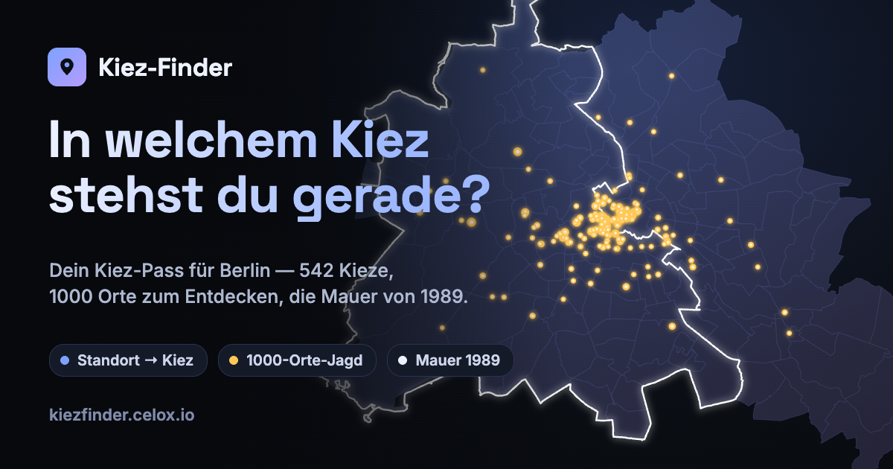
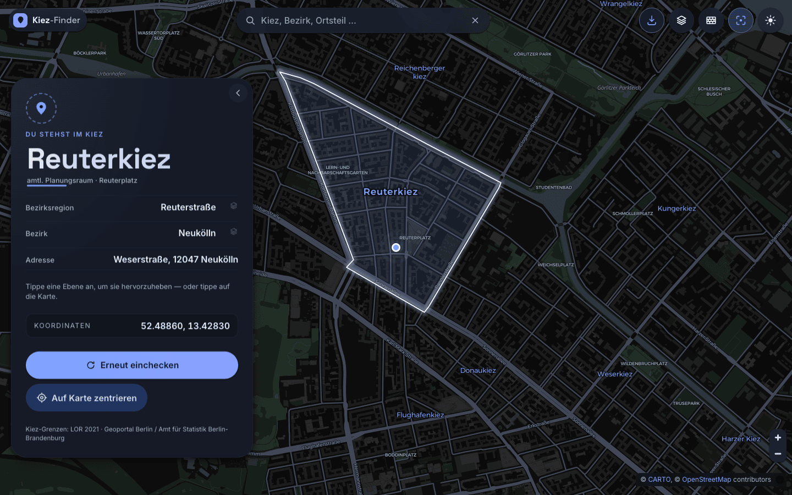
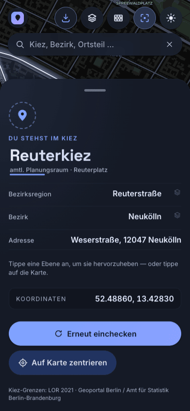
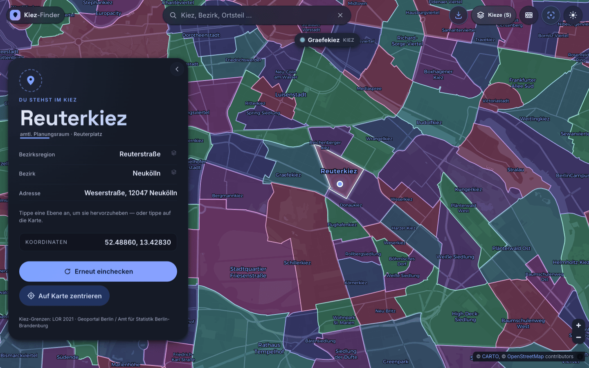
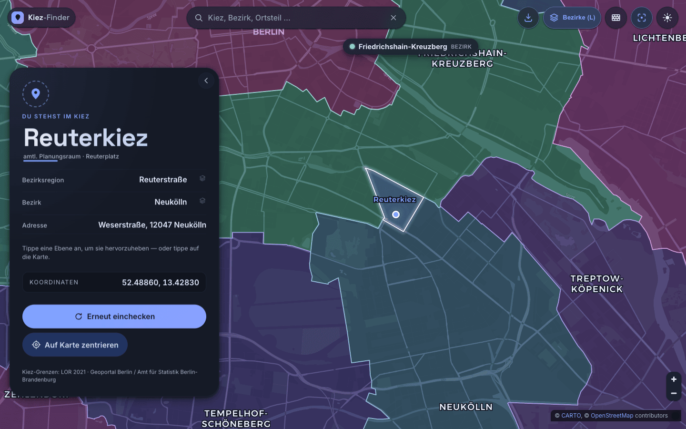
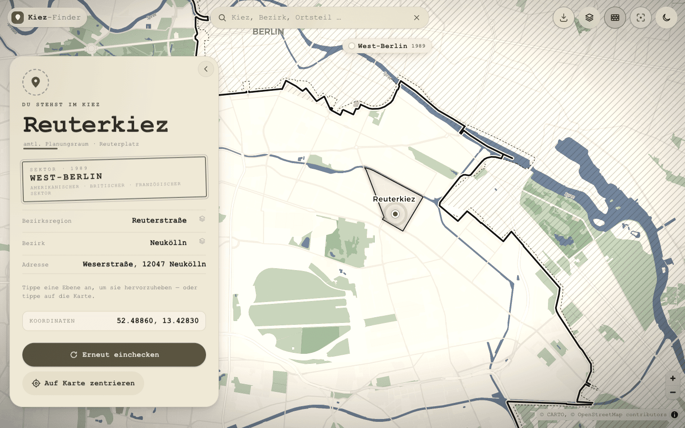

<div align="center">



# 🧭 Kiez-Finder

### Dein Kiez-Pass für Berlin — check ein und erfahre sofort, in welchem Kiez du gerade stehst.

[](https://github.com/pepperonas/kiez-finder/actions/workflows/ci.yml)
[-100%25_lines-brightgreen)](#tests-ausf%C3%BChren)
[](https://kiezfinder.celox.io)
[](package.json)
[](LICENSE)
[](#tech-stack)

</div>

---

## Was ist das?

Berlin ist keine Stadt, sondern ein Haufen Kieze. **Kiez-Finder** bestimmt per Geolocation,
in welchem der **542 offiziellen Berliner Planungsräume (LOR 2021)** du gerade stehst,
zeichnet die Grenze deines Kiezes auf die Karte und zeigt dir die volle Hierarchie:

> **Kiez** → Bezirksregion → Prognoseraum → **Bezirk**, dazu die genaue Adresse und Koordinaten.

Die Klassifizierung läuft gegen die **amtlichen Kiez-Grenzen** (Point-in-Polygon im Browser) —
nicht gegen ungenaues Reverse-Geocoding. Stehst du außerhalb der Stadtgrenze, sagt der Pass dir das auch.

**Das Konzept: ein Kiez-Pass.** Eine einzige Idee, durch jede Schicht gezogen: *Du checkst an
deinem Standort ein, und die Stadt verrät dir, welcher Kiez dich gerade beherbergt.* Die Sprache
(„einchecken"), die Karte (eine gestempelte Pass-Karte), der **Signature-Moment** (Lock-on: die
Kamera fliegt zu dir, dann zeichnet sich deine Kiez-Grenze selbst ein) und der Leerzustand
(„außerhalb der Stadtgrenze gilt der Pass nicht") gehorchen alle diesem einen Satz.

## Features

- 🔎 **Fuzzy-Suche** über alle Ebenen (Bezirke · Bezirksregionen · Prognoseräume · Kieze · Planungsräume) **und jede benannte Straße Berlins** — eigener, abhängigkeitsfreier Berlin-getunter Scorer: Umlaut-/ß-/„straße"-Faltung, Präfix→Wort→Substring→Subsequenz→Tippfehler-Tiers, ~2 ms/Suche über ~12.500 Einträge. Treffer wählen → Fläche wird hervorgehoben
- 🛣️ **Straßensuche** — alle ~10.100 benannten Straßen (Overpass/OSM, ~11.400 Einträge: gleichnamige Straßen in verschiedenen Stadtteilen bleiben getrennte Treffer, unterschieden per Bezirk-Unterzeile). Straße wählen → Beacon landet **auf der Straße**, ihr **Kiez wird aufgelöst und hervorgehoben** („Sonnenallee → in Weiße Siedlung · Neukölln"), die Kamera rahmt die **volle Straßenausdehnung** (kurze Gassen nah bei max z15.5, die 5-km-Sonnenallee komplett). Datensatz: kompakte 833 KB (`strassen.json`), einmalig gebaut via `tools/build-streets.js`
- 📍 **Standort → Kiez** über die offiziellen LOR-2021-Planungsräume (542 Kieze), Point-in-Polygon im Browser
- 🗣️ **Umgangssprachlicher Kiez** — der geläufige Kiez-Name (z.B. *Schillerkiez*, *Flughafenkiez*) ist der Titel; der amtliche Planungsraum (z.B. *Wartheplatz*) steht als Unterzeile
- 🧩 **Kiez als EINE Fläche** — ein umgangssprachlicher Kiez besteht oft aus mehreren amtlichen Planungsräumen (Schillerkiez = Hasenheide + Schillerpromenade Nord/Süd + Wartheplatz). Die werden **zusammengeführt** und als eine zusammenhängende Fläche hervorgehoben — präzise, nicht die zu grobe Bezirksregion (355 Kiez-Flächen aus 542 Planungsräumen)
- 🏘️ **Feinkörnige OSM-Kieze** — benannte Kieze, die *kleiner* als ein Planungsraum sind (z.B. *Scheunenviertel*, *Möckernkiez*, *Fischerinsel*), kommen mit ihrer **exakten OSM-Grenze** (71 Polygone) — suchbar, hervorhebbar und beim Drinstehen automatisch erkannt
- 🧅 **Wählbare LOR-Ebenen** — tippe in der Card auf **Kiez · Bezirksregion · Bezirk**, und die zugehörige Fläche wird hervorgehoben (Auto-Zoom auf ihre Ausdehnung)
- 🖱️ **Karte ist anklickbar** — tippe irgendwohin in Berlin, und die Card springt auf den Kiez dieses Punkts (inkl. neuer Adresse)
- ⛶ **Auto-Zoom-Schalter** (Topbar) — legt fest, ob ein **Karten-Tap** automatisch auf den getroffenen Kiez heranzoomt (Standard: an). Ausgeschaltet wird die Fläche zwar markiert, die Kamera bleibt aber stehen — praktisch zum Erkunden benachbarter Kieze, ohne dass die Karte bei jedem Tipp springt. Betrifft nur den Tap; „Auf Karte zentrieren", die Ebenen-Auswahl, die Suche und der Geo-Check-in rahmen weiterhin. Zustand wird gemerkt
- 🗺️ **Sektoren-Overlay** (4-Stufen-Button) — *aus · Bezirke (L) · Regionen (M) · Kieze (S)*, von grob nach fein. Färbt die jeweilige Ebene **nachbarschafts-bewusst** (Distanz-2-Graph-Coloring über geteilte Grenzen) → angrenzende **und** nahe Flächen bekommen weit auseinanderliegende Farbtöne und sind klar unterscheidbar. **Jede sichtbare Fläche wird beschriftet** — pro Region ein Label an einem sichtbaren Innenpunkt, beim Zoomen/Verschieben nachgeführt (nicht nur die Fläche, deren Mittelpunkt zufällig im Bild liegt); **kartografische Hierarchie**: Kollisionspriorität + Labelgröße folgen der Flächengröße (große Flächen gewinnen und lesen größer), bedrängte Labels weichen per variablem Anker aus statt zu verschwinden, Label-Punkte bleiben beim Verschieben stabil (Anti-Jitter-Hysterese), und die **ausgewählte Fläche trägt immer ihr eigenes akzentfarbenes Label** (höchste Priorität, keine Doppelung). Zusätzlich benennt eine schwebende **„Aktueller-Bereich"-Plakette** mit Farbpunkt live die Fläche in der Kartenmitte
- 🟦 **Starke Auswahl-Umrandung** — die aktive Auswahl wird mit kräftiger heller Linie + dunklem Casing-Halo gezeichnet, damit sie auch über dem dichten Farb-Overlay klar heraussticht
- 🧱 **Berliner-Mauer-Modus (Retro)** — eigener Topbar-Button: die Karte wechselt in einen **Schwarz-Weiß-Archivlook** (Graustufen + Sepia-Hauch, Filmkorn, Vignette) und zeigt den **offiziellen Mauerverlauf von 1989** (Geoportal Berlin, digitalisiert vom Luftbild 25.04.1989): Grenzmauer als markante Doppellinie, Hinterlandmauer gestrichelt, **Grenzstreifen („Todesstreifen") als echte Fläche**, und **beide Stadthälften eigenständig getönt** (West als solide Aufhellung, Ost zusätzlich **diagonal schraffiert** — die klassische Archiv-Signatur, beide klar vom Brandenburger Umland abgesetzt) mit großen **WEST-BERLIN / OST-BERLIN**-Sektor-Schriftzügen im Archivkarten-Stil. Dazu **zwei Spot-Farben wie auf alten Druckkarten**: Spree, Kanäle und Seen in gedecktem **Tintenblau**, Parks in gedämpftem **Grün** — übersättigt ins Canvas gemalt, sodass sie den (abgeschwächten) S/W-Filter als gealterte Töne überleben. Die schwebende Plakette wird zum **Ost/West-Anzeiger** („West-Berlin · 1989") — Point-in-Polygon gegen die abgeleiteten Sektor-Polygone (West 480 km² aus Grenzmauer + politischer Grenze verschmolzen; Ost 410 km² = Stadtgebiet minus Mauerring, inkl. der historisch korrekten DDR-Exklave **West-Staaken**). Der Modus erfasst die **ganze Seite**: alle UI-Flächen (Pass-Karte, Topbar, Suche, Buttons, Plakette) wechseln auf ein Tusche-/Papier-Farbschema und **Schreibmaschinen-Typografie** (System-Courier, 0 KB), und die Pass-Karte bekommt einen **Aktenstempel** „SEKTOR · 1989 — OST-BERLIN / Sowjetischer Sektor" (bzw. West: „Amerikanischer · Britischer · Französischer Sektor"), der dir sagt, auf welcher Seite der Mauer dein Standort gelegen *hätte*. Modus persistiert; schließt sich mit dem Farb-Overlay gegenseitig aus (Farben wären in S/W sinnlos), das vorherige Overlay kommt beim Verlassen zurück
- 🏷️ **Eigene Label-Ebene** — Bezirke groß/hell (schon bei weitem Zoom), Bezirksregionen kleiner; MapLibre-Kollision zeigt immer die im Ausschnitt passenden Labels (Basemap-Ortsteil-Labels werden ausgeblendet, damit die offizielle Hierarchie dominiert)
- 🗺️🗣️ **Umgangssprachliche Kiez-Namen auf der Karte** — 537 OSM-Kieze (`place=quarter`/`neighbourhood`, z.B. Flughafenkiez, Reuterkiez, Sprengelkiez) als akzentfarbene Labels bei höherem Zoom
- 🗺️ **Lebendige Vektorkarte** (MapLibre GL) mit `flyTo`-Lock-on und sich selbst zeichnender Kiez-Grenze; ab Kiez-Zoom erscheinen **Straßennamen und Grünflächen dezent** (gedämpfte Töne + sanftes Grün, eine Zoomstufe früher als die Basemap sie zeigen würde — sie ordnen sich den Kiez-Labels immer unter)
- 🎨 **Material 3 Expressive** — Feder-Physik statt Easing-Fades, tonale Flächen, XL-Shapes, Shape-Morph beim Tippen
- 🌗 **Hell/Dunkel** mit kreisförmigem View-Transition-Reveal wie auf celox.io (900 ms Desktop / 520 ms Mobile, dark-matter ↔ positron), **der auch die Karte mitzieht**: die WebGL-Karte restylt erst nach der Animation, deshalb wird sie während des Reveals per invert-Filter aufs Ziel-Theme angenähert und hinter einem eingefrorenen Standbild („Veil") umgestylt, das erst weich ausblendet, sobald die neuen Kacheln wirklich gerendert sind — kein harter Blitz, auch bei schnellem Hin-und-her-Schalten
- 📱 **PWA + Mobile** — installierbar, **echt offline-fähig**: alle 14 Datensätze (~2,3 MB — Kieze, Bezirke, Regionen, Labels, Mauerverlauf, Straßenindex …) werden vom Service Worker **revisioniert precached** — einmal besucht, klassifiziert die App auch ohne Netz, und Daten-Updates busten den Cache automatisch beim Deploy. Schlägt der Kern-Datensatz beim allerersten Laden fehl (offline/404), zeigt die App eine ehrliche **„Daten nicht geladen"-Card mit Retry** statt fälschlich „nicht in Berlin". Die Card ist auf Mobilgeräten ein **MD3-Bottom-Sheet** mit echten **Swipe-Gesten**: vom 44-px-Griff oder der ganzen Karte hoch-/runterziehen, **Pull-down vom Listenanfang** zum Einklappen, **Tap aufs eingeklappte Sheet** zum Öffnen; geschwindigkeits- + positionsbasiertes Snapping (leichter Flick genügt), Scroll-vs-Drag korrekt getrennt, nicht-modal über der Karte, Safe-Area-Insets, `dvh`-Höhe. Auf **Desktop** lässt sich das Info-Panel ein- und ausklappen (Pfeil-Button → schiebt es zur Seite, Reopen-Tab holt es zurück; Zustand wird gemerkt)
- ♿ **Robust** — Progressive Enhancement, `prefers-reduced-motion`, sichtbarer Fokus, Tastatur (`R` = neu einchecken), Touch-Targets ≥ 44 px
- 🔑 **Kein API-Key** — keyless Carto-Tiles + Nominatim, keine Secrets im Code

## Screenshots

<div align="center">



<sub><i>Der Signature-Moment: Lock-on auf den Standort, die Kiez-Grenze zeichnet sich selbst ein</i></sub>

<br/><br/>


&nbsp;


<sub><i>MD3-Bottom-Sheet auf Mobil · Kieze-Overlay (S): das nachbarschafts-bewusst eingefärbte Kiez-Patchwork</i></sub>

<br/><br/>


&nbsp;


<sub><i>Bezirke-Overlay (L) mit „Aktueller-Bereich"-Plakette · Berliner-Mauer-Modus 1989 mit Sektor-Stempel</i></sub>

</div>

## Installation

```bash
git clone https://github.com/pepperonas/kiez-finder.git
cd kiez-finder
npm install
```

Voraussetzungen: **Node ≥ 20** (die CI testet 20 + 22). Keine API-Keys, keine `.env` — es gibt keine Secrets.

## Quickstart

```bash
npm run dev       # Vite-Dev-Server (Geolocation braucht einen secure context → localhost zählt)
npm run build     # Production-Build nach dist/
npm run preview   # Build lokal testen
```

> **Hinweis:** Geolocation braucht einen *secure context*. `localhost` gilt als sicher; auf anderen
> Hosts muss HTTPS aktiv sein. Ohne Standort-Freigabe funktioniert die App trotzdem — einfach auf
> die Karte tippen oder die Suche benutzen.

## Konfiguration

Die App hat **keine Build-Konfiguration und keine Secrets** — alles Nutzer-Einstellbare wird
automatisch in `localStorage` persistiert:

| Key | Werte | Bedeutung |
|---|---|---|
| `kf-theme` | `dark` \| `light` | Farbschema (Default: dunkel bzw. `prefers-color-scheme`) |
| `kf-overlay` | `off` \| `bezirke` \| `bzr` \| `kiez` | aktives Sektoren-Overlay |
| `kf-wall` | `1` \| `0` | Berliner-Mauer-Modus |
| `kf-autozoom` | `1` \| `0` | Auto-Zoom beim Karten-Tap (Default: an) |
| `kf-panel` | `open` \| `collapsed` | Desktop-Info-Panel ein-/ausgeklappt |

Fürs **Hosting** gibt es genau ein Muss: der Webserver muss
`Permissions-Policy: geolocation=(self)` **auf dem HTML-Dokument** setzen — bei nginx auch im
`location = /index.html`-Block, weil das `try_files`-Fallback die Server-Header dort sonst
verwirft (Details in [CLAUDE.md](CLAUDE.md)).

### Kiez-Daten neu erzeugen

Die Grenzen liegen vorverarbeitet unter `public/data/`. Neu aus der amtlichen Quelle bauen:

```bash
# 1) LOR-2021-Planungsräume (WGS84) vom Geoportal Berlin
curl "https://gdi.berlin.de/services/wfs/lor_2021?service=WFS&version=2.0.0&request=GetFeature&typeNames=lor_2021:a_lor_plr_2021&outputFormat=application/json&srsName=EPSG:4326" -o plr.geojson

# 2) auf die nötigen Felder reduzieren + vereinfachen (~628 KB)
npx mapshaper plr.geojson -filter-fields plr_id,plr_name,bzr_name,pgr_name,bez \
  -simplify 12% keep-shapes planar -clean -o public/data/kieze.geojson precision=0.00001

# 3) Stadtgrenze für den Übersichts-Zustand
npx mapshaper public/data/kieze.geojson -dissolve -o public/data/berlin-outline.geojson precision=0.0001

# 4) aggregierte Ebenen für die Highlight-Auswahl (aus den Kiezen dissolved,
#    genestet über die plr_id-Präfixe: Bezirk 2 ⊃ Prognoseraum 4 ⊃ Bezirksregion 6 ⊃ Kiez 8)
npx mapshaper public/data/kieze.geojson -each 'id=plr_id.substring(0,2)' -dissolve id copy-fields=bez                -o public/data/bezirke.geojson precision=0.0001
npx mapshaper public/data/kieze.geojson -each 'id=plr_id.substring(0,4)' -dissolve id copy-fields=pgr_name,bez       -o public/data/prognoseraeume.geojson precision=0.00001
npx mapshaper public/data/kieze.geojson -each 'id=plr_id.substring(0,6)' -dissolve id copy-fields=bzr_name,bez       -o public/data/bezirksregionen.geojson precision=0.00001

# 5) zusammengeführte „Kiez-Flächen" (umgangssprachliche Kieze):
#    jeder Planungsraum wird per Reverse-Geocoding (Nominatim, quarter/neighbourhood)
#    seinem umgangssprachlichen Kiez zugeordnet, dann nach Kiez-Name + zusammenhängender
#    Komponente gruppiert (shared-vertex Adjazenz) und per `-dissolve gid` verschmolzen.
#    Ergebnis: kieze.geojson bekommt gid+kiez je Planungsraum, kiez-areas.geojson = eine
#    Fläche je Kiez (355 aus 542). Quarter ist nicht flächendeckend → ~78 % Abdeckung,
#    der Rest bleibt sein eigener Planungsraum. (Build-Skripte: siehe git-Historie.)

# 6) OSM-Kiez-Namen (Punkt-Labels) via Overpass → kiez-names.geojson
#    node-Query: place=quarter|neighbourhood in Berlin → 537 Punkte

# 7) Straßenindex → strassen.json (für die Suche)
#    Overpass: alle benannten highway-Ways in Berlin mit per-Way-Bounds ("out tags bb;",
#    Query im Kopf von tools/build-streets.js), dann:
curl -sS --data-urlencode data@query.txt https://overpass-api.de/api/interpreter > streets-raw.json
node tools/build-streets.js streets-raw.json
#    93.831 Ways → 10.119 Namen → 11.446 Cluster (Union-Find: gleichnamige Segmente
#    innerhalb ~300 m verschmelzen; entfernte Namensvettern wie die 10 Hauptstraßen
#    bleiben getrennt). Je Cluster: Union-BBox, ein Punkt AUF der Straße, Bezirk per
#    eigenem Point-in-Polygon. Kompaktformat [name, bezIdx, cx, cy, bbox×4] → 833 KB.
```

### Screenshots neu erzeugen

```bash
npm run build && npm run preview -- --port 4190   # Terminal 1
node tools/screenshots.cjs                        # Terminal 2 (braucht Playwright + Chrome)
```

## Tests ausführen

```bash
npm test                                          # 56 Unit-Tests, Nodes eingebauter Runner, null Test-Dependencies
node --test --experimental-test-coverage tests/   # dito + Coverage-Report
```

Getestet wird die **abhängigkeitsfreie Pure-Logik** — Stand heute **56 Tests, 100 % Line-Coverage**
auf allen drei unit-testbaren Modulen (96 % Branch):

| Modul | Was abgesichert ist |
|---|---|
| `src/kiez.js` | Point-in-Polygon-Klassifizierung (Löcher, MultiPolygon), Hierarchie-Ableitung (`featureForLevel`, `levelName`), `findOsmKiez`-Nesting (kleinste Fläche gewinnt), `kiezAreaFor`-Fallbacks — und die **Loader per fetch-Mock**: Memoisierung, optionale Datensätze fehlen sauber, Kern-Datensatz-Fehler wird als Fehler gemeldet (nie als „nicht in Berlin"), `loadWall`/`loadStreets` **Fail → Reset → Retry** |
| `src/search.js` | Umlaut-/ß-/„straße"-Faltung, Multi-Tier-Scoring, Typ-Priorität, Dedup, Straßen-Einträge |
| `src/prefs.js` | `localStorage`-Persistenz-Semantik (Defaults, Garbage-Fallback, werfende Storage) |

`main.js`/`map.js` hängen an DOM + MapLibre/WebGL und sind bewusst nicht unit-getestet — testwürdige
Logik wird stattdessen in maplibre-freie Module extrahiert (so entstand `prefs.js`). Die CI
(GitHub Actions, Node 20 + 22) führt Tests + Coverage + Production-Build bei jedem Push aus.

## Tech-Stack

| Schicht | Wahl | Warum |
|---|---|---|
| Build | **Vite 6** | Eine kleine JS-Insel, gehashte Assets, PWA-Plugin |
| Karte | **MapLibre GL JS 4** | Vektor-Tiles, weiche `flyTo`-Physik, Polygon-Layer |
| Tiles | **CARTO dark-matter / positron** | keyless, kostenlos, dunkel |
| Geocoding | **Nominatim (OSM)** | nur für die Adresszeile (gecacht, 1 req/s-Policy) |
| Motion | eigener **MD3-Feder-Integrator** | echte Spring-Physik (`stiffness`/`damping`), nicht CSS-Fades |
| Fonts | **Space Grotesk + Inter** (variable, self-hosted) | Display vs. Body, keine externen Requests |
| Tests | **`node --test`** | Nodes eingebauter Runner — null Test-Dependencies |
| UI | **Vanilla JS** | maximal klein, volle Kontrolle über jeden Frame |

### Motion-System

CSS kennt keine Federn — deshalb fährt die räumliche Bewegung (Position/Größe/Reveal, mit Overshoot)
über einen winzigen semi-impliziten Euler-Spring-Integrator (`src/motion.js`). Die Konstanten sind die
**M3-*Expressive*-Tokens** wörtlich:

| Spring | stiffness | damping | Einsatz |
|---|---|---|---|
| spatial-fast | 800 | 0.6 | Signatur-Bounce |
| spatial-default | 380 | 0.8 | Karten-/Listen-Reveal |
| spatial-slow | 200 | 0.8 | Kiez-Grenze zeichnet sich ein |

Opazität & Farbe („effects") bleiben auf MD3-Easing (`cubic-bezier(0.2,0,0,1)`) — ein überschwingender
Fade sieht kaputt aus. Ein Timing-System, überall wiederverwendet.

## Deploy

Statischer Build → `rsync` auf den celox.io-VPS, TLS via Let's Encrypt (certbot). Die Nginx-Config
muss `Permissions-Policy: geolocation=(self)` auf dem HTML-Dokument setzen (siehe
[Konfiguration](#konfiguration)):

```bash
npm run build
rsync -avz --delete dist/ root@<vps>:/var/www/kiezfinder.celox.io/
```

## Datenquellen

- **Kiez-Grenzen:** LOR 2021 Planungsräume — *Geoportal Berlin / Amt für Statistik Berlin-Brandenburg* (CC-BY-3.0 DE)
- **Mauerverlauf:** „Verlauf der Berliner Mauer, 1989" — *Geoportal Berlin*
- **Straßen:** © OpenStreetMap-Mitwirkende via Overpass API (ODbL)
- **Karten:** © OpenStreetMap-Mitwirkende, © CARTO
- **Adresse:** Nominatim / OpenStreetMap

## Mitmachen

Issues und PRs willkommen. Die App ist bewusst klein und abhängigkeitsarm — bitte halte sie so.
Vor einem PR: `npm test` (die CI läuft mit Node 20 + 22).

## Lizenz

[MIT](LICENSE) © Martin Pfeffer ([pepperonas](https://github.com/pepperonas))

---

<div align="center"><sub>Made with ❤️ in Berlin · © 2026 Martin Pfeffer | <a href="https://celox.io">celox.io</a></sub></div>
